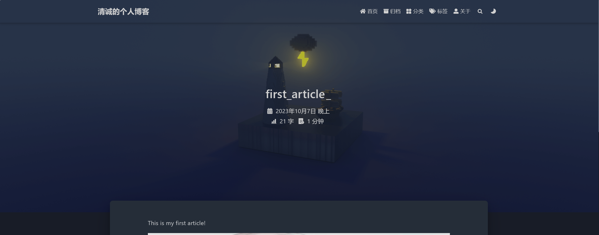
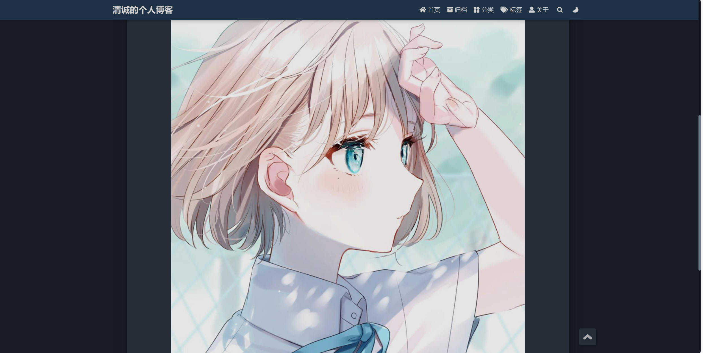

#个人博客建立
关于个人博客的建立我采用了hexo上的fluid框架，找了一些，这个框架我很喜欢。整个搭建的过程都很流畅除了最后一步，把它提交到git pages上。我之前在Windows上面下载的git bash并没有进行配置（在另一个Linux系统上配置了）。最后在Windows上开了个仓库，改了用户名和邮件一下就连接好了。我的个人博客的url在下面，欢迎来看看。
[清诚的个人博客](https://zqk019.github.io/)

### 接下来是我完善的一些功能的介绍
1.首先我按照教程教的把那个浏览次数检测功能打开了，还注册了一个leancloud账号来检测。顺便还把页脚的访问次数与访问人数打开了。下面是附图：

2.接下来我尝试自己新发了一个article，名字就叫first_article，内容就是放了一张我很喜欢的图片而已。

3.
ps:之后会一直完善的。

好吧，我后面又看了一眼招新题，居然是自制一个博客，好吧，我做一些，不一定做得完，见谅了。
### [自制Blog](https://htmlpreview.github.io/?https://github.com/zqk019/JotangTest/blob/master/fifth/blog/index.html) 
自制一个Blog有点繁琐，而且对我这样的小白有些不友好，举个简单的例子，我记css的link都记了好几遍才勉强能够自己敲出来，自己设置的css外部样式也是自己都记不住。。。
然后简单的介绍一下我的自制博客吧(求求别骂我)。
1.First commit（10.15）:
* 首先是自我介绍：就只是几排字而已。
* 照片墙：我知道就只是把照片放上去了，其他啥也没做。截止日期快到了，不知道自己在ddl之前还能不能再美化一下。
* 文章分享（？？？我自己都不觉得）：是文章分享。。。
  
2.Second commit（10.20）:
好好好，鬼知道我是怎么在这几天看完一百多集的教程的（虽然每集平均下来10min左右）人都要变形了。

OK，闲话说完，回归正题。通过这次学习html和css，我算是明白了一个好的视频教程是有多么重要了~~鬼知道我当初学C++的时候是怎么直接啃书学过来的~~。而且这次自制blog让我认识到自己的生活有点单一了（不知道往Blog写些什么。最重要~~痛苦~~的是让我知道实际操作的重要性。想写一个页面，仅仅是看一遍纸质教程是远远不够的，各种奇奇怪怪的规则，各种奇奇怪怪的元素，是要实际经过练习才能掌握的。

最后，虽然我的Blog还是很简陋，不过我打算以后一直去经营这个Blog（不用框架那个了）。

  
  
  （~~打个广告~~很感激尚硅谷，因为教程很棒）

