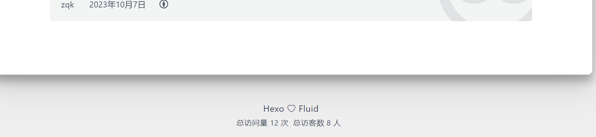
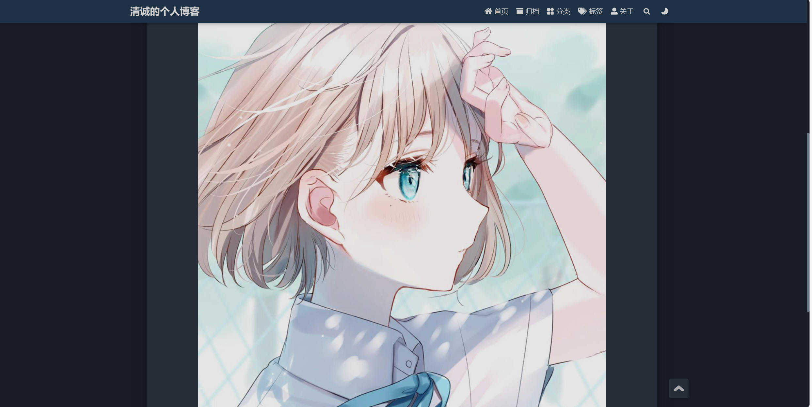

#个人博客建立
关于个人博客的建立我采用了hexo上的fluid框架，找了一些，这个框架我很喜欢。整个搭建的过程都很流畅除了最后一步，把它提交到git pages上。我之前在Windows上面下载的git bash并没有进行配置（在另一个Linux系统上配置了）。最后在Windows上开了个仓库，改了用户名和邮件一下就连接好了。我的个人博客的url在下面，欢迎来看看。（很简陋，别喷我）
<https://zqk019.github.io/>

### 接下来是我完善的一些功能的介绍
1.首先我按照教程教的把那个浏览次数检测功能打开了，还注册了一个leancloud账号来检测。顺便还把页脚的访问次数与访问人数打开了。下面是附图：

2.接下来我尝试自己新发了一个article，名字就叫first_article，内容就是放了一张我很喜欢的图片而已。

3.
ps:之后会一直完善的。

好吧，我后面又看了一眼招新题，居然是自制一个博客，好吧，我做一些，不一定做得完，见谅了。